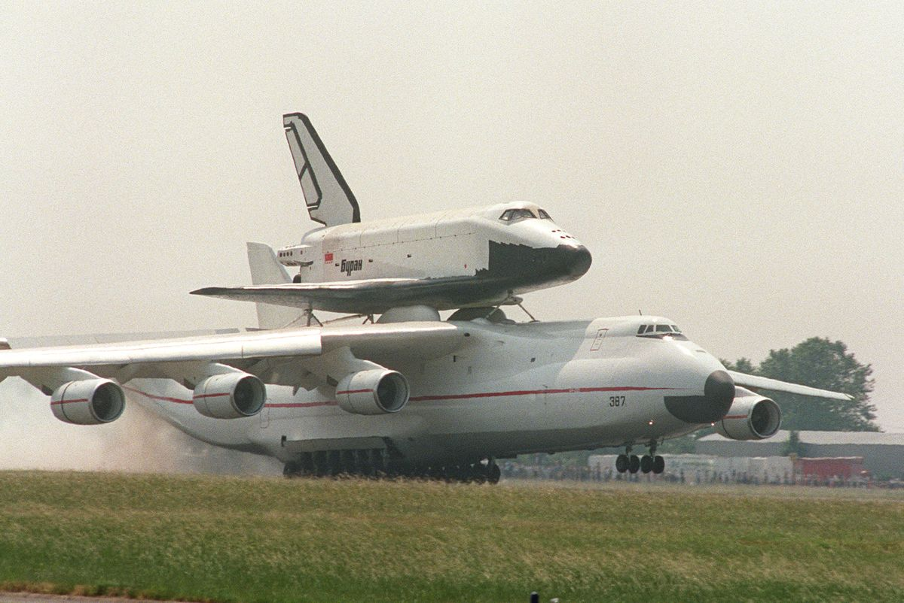
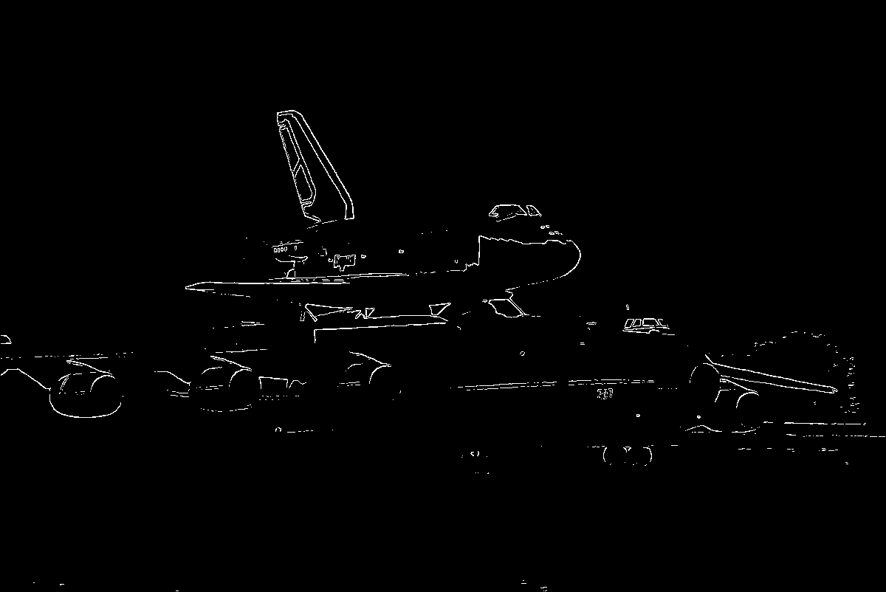

# Fundamental Computer Visions Algorithm Implemented in C++ with STL 

## Pre-requisite
- OpenCV 
- Eigen

## Algorithms Implemented So Far
- Canny Edge Detector

## Working On
- SIFT  

## Results

#### Test file, Space Shuttle Buran

#### Result of the Canny Edge Detection on Buran

